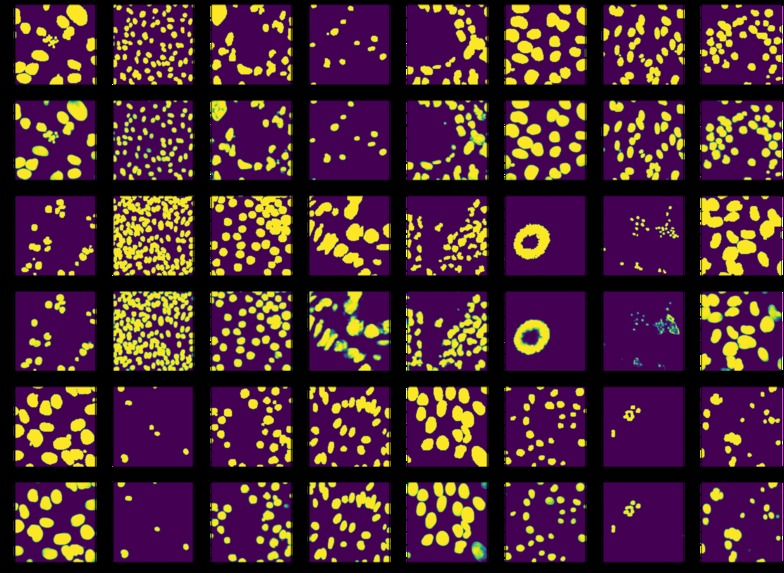

# Nuclei Detection
Contains util extractors for Nuclei detection in order to accelerate medical discovery, drug discovery &amp; cures for diseases.

[Segmentation model to be added after publishing the cool stuff - Needed the utils to be out of drive badly :(]

 
This is a data sample. Rows alternate from ground truth to predicted image

## Inspiration

Why don't we have immortality? What are so many people still plagued with diseases? I mean, we're in the 21st century right - why are we still infested with the same diseases that our ancestors had to deal with for thousands of years?

We still haven't cured diseases, but that isn't due to a lack of effort. We've made huge strides and progress. From automating laboratories to new drug discovery technologies.

But one bottleneck still remains: analyzing the data. We can get robots to automate the synthesis of drugs, experimentation and even microscopy, but not data analysis.

So why don't we use machine learning to do that for us. To use Machine learning to pear into the microscopic world, to aid us to acCELLerate the curing of all diseases!

## What it does
One major task that scientists undergo is identifying the nuclei within cells. Cells are complicated. They have lots of different types, shapes, stains, and states. Thus we have to find a generalized way of tackling this problem (else the biologist literally has to look at the images themselves).

I utilize a novel segmentation model (to be included here after paper gets published) to tackle this very problem and have the capability to detect and create a masking layer onto of the image to localize all the nuclei in an image. This model is generalized to be able to tackle all states in which cells can be in.

## What's next
There are certainly other ways in which biologists are analyzing the data - it's not just nuclei identification. To expand to other types of analysis allows us to be able to leverage the process of us never dying by diseases again!

## What's in it for now
The codebase has the extractor and the mask stitching part. The dataset is completely raw, trust me on this.

The entire process has a lot many steps after this including creating thresholded masks, segmenting image sets, extracting regions and verifying accuracies. All of which are to be added when I am allowed to XD.
